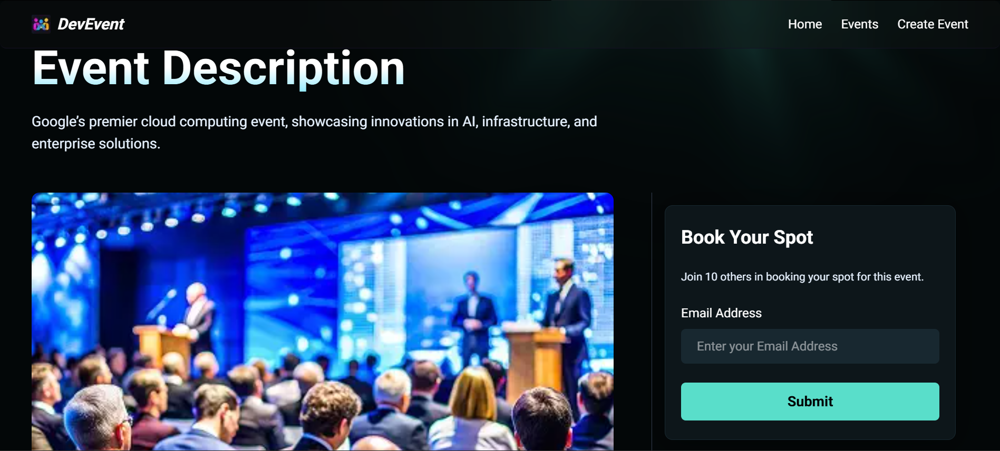
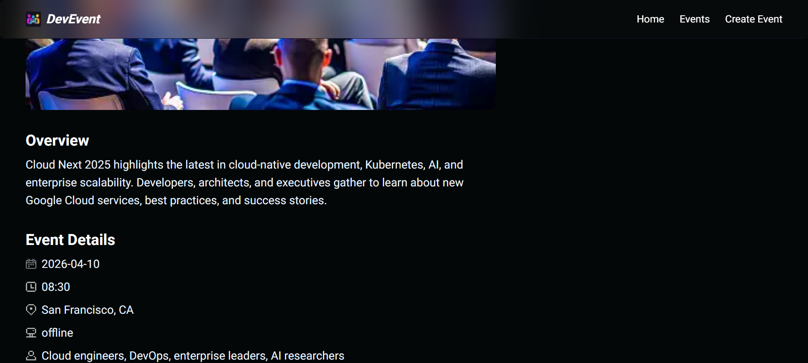
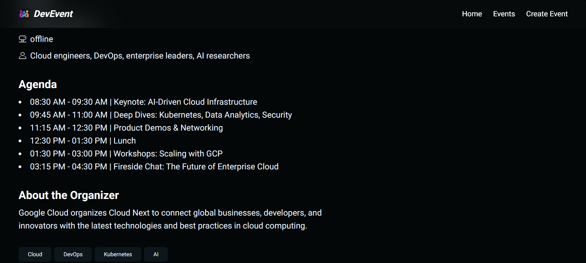

🚀 DevEvent — Developer Event Platform

🌍 A modern platform for developers to discover, book, organize, and share tech events worldwide.

📌 Overview

DevEvent is a developer-focused event management platform designed specifically for the tech community.
The platform allows developers to:

🔍 Discover developer events worldwide
🎟️ Book seats for hackathons, meetups, and conferences
🧑‍💻 Organize and publish events
🌐 Share events with the community
📅 Manage event registrations efficiently

Unlike traditional event platforms, DevEvent focuses on creating a clean, fast, and developer-centric experience.

Inspired by the growing need for a centralized hub for hackathons, coding meetups, workshops, and tech conferences.

✨ Features
👨‍💻 User Features
🔐 Authentication & Authorization
🌍 Browse global developer events
🔎 Search & filter events
📄 Detailed event pages
🎟️ Event booking system
📅 Personal booking management
📱 Fully responsive UI
⚡ Fast and modern UX
🧑‍🏫 Organizer Features
➕ Create new events
✏️ Edit & manage events
🖼️ Upload event banners/images
👥 Manage attendees
📊 Event dashboard
🛠️ Tech Stack
Technology	Usage
⚛️ React / Next.js	Frontend Framework
🎨 Tailwind CSS	Styling
🔥 TypeScript	Type Safety
🍃 MongoDB	Database
🔐 Authentication	User Management
☁️ Cloudinary / Image Hosting	Media Storage
🚀 Vercel	Deployment
📸 Screenshots
<!-- 
Add your project screenshots here for maximum impact.

🏠 Home Page

📅 Events Page

🎟️ Event Details

🧑‍💻 Organizer Dashboard
 -->

⚙️ Installation & Setup
1️⃣ Clone the Repository
git clone https://github.com/Alok2304/developer-event-app.git
2️⃣ Navigate to Project Directory
cd developer-event-app
3️⃣ Install Dependencies
npm install
4️⃣ Configure Environment Variables

Create a .env.local file in the root directory.

MONGODB_URI=
NEXTAUTH_SECRET=
NEXTAUTH_URL=
CLOUDINARY_CLOUD_NAME=
CLOUDINARY_API_KEY=
CLOUDINARY_API_SECRET=
5️⃣ Run Development Server
npm run dev
🧪 Future Improvements
💬 Real-time event chat
🤖 AI-based event recommendations
📍 Location-based event discovery
🧾 Ticket QR verification
📧 Email notifications
📱 Mobile app version
🌎 Multi-language support
📂 Project Structure
developer-event-app/
│
├── app/
├── components/
├── lib/
├── models/
├── public/
├── styles/
├── utils/
├── types/
└── ...
🌟 Why This Project Stands Out
🎯 Built specifically for developers
⚡ Modern UI/UX focused architecture
📱 Fully responsive
🧩 Scalable component structure
🚀 Production-ready deployment architecture
🧠 Strong real-world full-stack concepts
🤝 Contributing

Contributions are always welcome!

Fork the repository
Create a new branch
git checkout -b feature-name
Commit your changes
git commit -m "Added new feature"
Push to your branch
git push origin feature-name
Open a Pull Request
📈 Repository Stats

🧠 Lessons Learned

While building this project, I learned:

Full-stack application architecture
Authentication workflows
Database schema design
File uploads & cloud storage
State management
Responsive UI engineering
Real-world deployment practices
👨‍💻 Author
Alok Kale
GitHub: Alok2304
LinkedIn: https://linkedin.com/in/alokkale1207
📜 License

This project is licensed under the MIT License.

⭐ If you like this project, consider giving it a star on GitHub!

Repository: developer-event-app Repository
